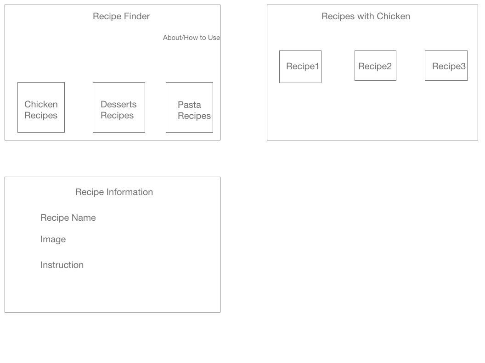

### recipe-finder
### API used:

TheMealDB-https://www.themealdb.com/api.php

### Problem Statement

An app which helps to find, save and organize all your favorite recipes. 

### Target Users

Anyone who wants to find and keep their recipes organized

### Wireframe

Stateful Components :
1. ChickenRecipes.js - Axios request is made to fetch recipes using chicken
2. Pasta.js-Axios request is made to fetch recipes under Pasta Category
3. Dessert.js-Axios request is made to fetch recipes under Dessert Category

Stateless Components : 
1. RecipeFinder.js - displays navigation link to different recipes
2. About.js - displays information about recipe finder
3. ChickenRecipeInformation.js - display Information for the selected recipe
4. PastaRecipeInformation.js - display Information for the selected recipe
5. DessertRecipeInformation.js - display Information for the selected recipe

